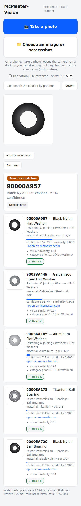
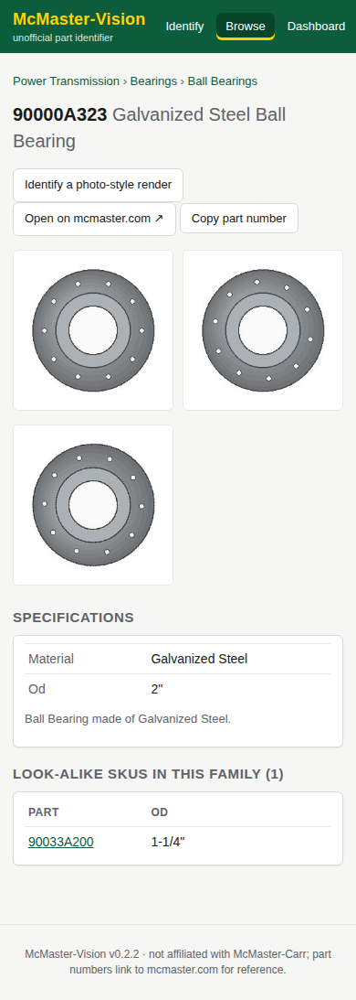
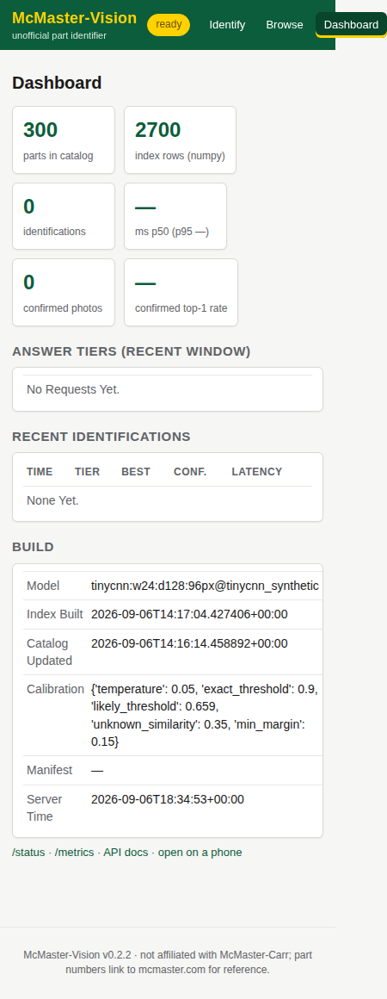

# McMaster-Vision

Photo in, McMaster-Carr part number out.

Upload a picture of a screw, bearing, fitting, or any of the ~700,000 SKUs in the
McMaster-Carr catalog and the system returns the most likely part numbers with a
calibrated confidence and the evidence behind each candidate.

```
photo ──▶ preprocess ──▶ embed ──▶ vector search (top-K) ──▶ rerank ──▶ calibrate ──▶ 91251A537 (94%)
                (crop, EXIF)   (CLIP/DINOv2)   (FAISS, 700k)   (fusion + Claude vision)
```

The problem is treated as **fine-grained image retrieval**, not a 700,000-way
classifier: every catalog image is embedded once into a vector index, a query photo
is embedded with the same model, nearest neighbours become candidates, and a
reranking stage resolves the look-alikes. See [ARCHITECTURE.md](ARCHITECTURE.md).

## Status

Everything except the real imagery is built and tested (74 tests, including a
real-browser run of the phone UI):

| area | state |
|---|---|
| intake | validate, normalise, de-duplicate, fetch from URL lists, import from McMaster pages, screenshots |
| models | hash (no deps), TinyCNN (shipped checkpoint), CLIP / DINOv2 (needs weights + GPU), ensemble |
| retrieval | TTA multi-query, gallery augmentation, query expansion, category prior, FAISS above 50k vectors, parallel + incremental builds |
| answers | calibrated tiers with precision-targeted thresholds, family answers with distinguishing attributes, constraints, category guess |
| interface | camera-first PWA, several angles per query, one-tap confirmation, text search, batch endpoint and CLI |
| operations | bootstrap, doctor, status, metrics, retrain (cron), hot reload, rate limit, request log, runbook |
| needs you | McMaster images (any of the intake paths), a GPU for CLIP/DINOv2, real photos via the feedback loop |

## Demo in 60 seconds

(`DEMO.md` is the five-minute stage script.)

```bash
pip install -e ".[dev,phone]"        # add ,ml for the learned model (torch)
mcv up                               # builds a synthetic demo catalog once, then serves it
```

`mcv up` prints a QR code; scan it with your phone (same Wi-Fi). In the app,
**Take a photo** of anything, or tap a **sample part** to watch a photo-style
render get identified live, or open **print a sheet**, print it, and photograph
the paper with the phone. `mcv up --https` makes the app installable with a
live camera preview. Once you have built a real catalog (`mcv bootstrap`),
`mcv up` serves that instead.

## Quick start (no GPU, no proprietary data)

```bash
pip install -e ".[dev]"
mcv demo --parts 300           # synthetic catalog -> index -> evaluation -> UI on :8000
```

`mcv demo` renders a synthetic hardware catalog, ingests it, builds the index,
reports Recall@K on photo-style augmented queries, identifies a sample query, and
serves the upload UI at http://127.0.0.1:8000.

The synthetic catalog covers 39 hardware families (screws, nuts, washers, pins,
gears, bearings, fittings, springs, brackets, tools) in 14 materials with
canonical, top-down, and rotated views.

Two backbones run fully offline:

| backbone | what it is | when to use |
|---|---|---|
| `hash` | hand-crafted numpy descriptor | CI, plumbing, no torch |
| `tinycnn` | 1.6M-parameter residual net trained from scratch with `mcv train --config configs/train_tinycnn.yaml` | offline demos of the full learning loop |
| `ensemble` | weighted fusion of `tinycnn` + `hash` (best offline accuracy) | offline serving |

```bash
mcv demo --parts 800 --backbone ensemble                    # uses the shipped assets/tinycnn_synthetic.pt
mcv demo --parts 800 --backbone ensemble --train-epochs 24  # ...or train tinycnn first (~1 h on 4 CPU cores)
```

`assets/tinycnn_synthetic.pt` (6.5 MB) is a TinyCNN trained on 8,000 synthetic
parts; it is the default for `tinycnn` / `ensemble` in the demo when no
`--checkpoint` is given. It knows synthetic renders, not real photos:
retrain on your own images with `mcv train`.

Real accuracy on real photos comes from the CLIP / DINOv2 backbones plus
fine-tuning (below). See ARCHITECTURE.md for measured numbers.

## From images to a running system in one command

```bash
mcv validate  /path/to/drop            # what would go wrong (missing/corrupt/duplicate images, ...)
mcv bootstrap /path/to/drop --workers 4  # validate -> ingest + normalise -> embed + index -> evaluate + calibrate
mcv status                             # what is built
mcv serve                              # phone UI + API
```

The drop can be a folder of images named by part number, a `<part_number>/`
folder tree, a JSONL/CSV export, or a spreadsheet of image URLs
(`mcv fetch-images` downloads them first). Image-only drops get names,
categories and specs from McMaster pages with `mcv enrich`. New SKUs later:
`mcv ingest new.jsonl && mcv build-index --only-new`, then `POST /admin/reload`.
See [RUNBOOK.md](RUNBOOK.md) for the full operating guide and sizing at 700k parts.

## Using McMaster-Carr's own images

The most useful gallery is McMaster-Carr's own product imagery. Three ways in:

1. **Import product pages by part number or URL** (fetches the page, its images,
   name, category breadcrumb, and spec table; polite: one request at a time,
   `robots.txt` honoured, cached on disk):

   ```bash
   mcv import-web 91251A537 9452K21 https://www.mcmaster.com/3164T1/
   mcv import-web --file my_parts.txt        # one part number / URL per line
   mcv build-index
   ```

   This is meant for the parts you care about (an order history, a BOM, a shelf),
   not for crawling the whole catalog. McMaster-Carr's terms of use restrict
   automated bulk access; for the full 700k-SKU catalog use a licensed export or
   their account-holder Product Information API (`catalog/sources.py` has the
   adapter stub). The page parser was written against McMaster's page structure
   (JSON-LD product data, Open Graph tags, `ImageCache` images) and falls back to
   generic heuristics; verify it on a live page and adjust `McMasterParser` if
   their markup changes.

2. **Screenshots.** Save screenshots of product images into a folder named by
   part number (`91251A537.png`, `91251A537_2.png`, ...), optionally with a
   `meta.jsonl` of names/categories, then `mcv ingest that_folder`.

3. **Bulk exports** you already hold:

| Format | Shape |
|---|---|
| JSONL | one object per line: `part_number, name, category_path[], description, attributes{}, image_paths[], family_id` |
| CSV | same columns; `category_path` joined with `>`, `image_paths` with `;`; unknown columns become attributes |
| Directory | `<root>/<part_number>/{meta.json, *.jpg}` |

Optional extras: `ml` (torch, open_clip, timm), `faiss`, `ocr` (easyocr),
`llm` (anthropic), `segment` (rembg), `export` (onnx, onnxscript, onnxruntime),
`dev`, or `all`.

```bash
cp .env.example .env                         # set MCV_BACKBONE=openclip for real models
pip install -e ".[ml,faiss]"                 # torch + open_clip + faiss
mcv ingest data/catalog/parts.jsonl          # -> data/catalog/catalog.sqlite
mcv build-index --backend faiss              # embed every image -> data/index/parts/
mcv evaluate --fit-calibration               # Recall@K on augmented queries, fit confidence temperature
mcv identify photo.jpg                       # JSON result
mcv serve                                    # http://localhost:8000  (POST /identify)
```

## One photo, one answer (or several angles)



`mcv serve` hosts a phone-friendly page: **Take a photo** opens the camera on a
phone, desktop users can drop an image or paste a screenshot, the image is
downscaled client-side, and the answer comes back as a verdict card
(`exact / likely / candidate / unknown`) with the top candidates, their catalog
images, specs, evidence, and a link to the part on mcmaster.com. Open it from a
phone on the same network (`mcv serve --host 0.0.0.0`) or behind HTTPS for
camera access on iOS.

* **Live ID** (with the live camera): frames are identified continuously in
  fast mode and the running best guess is overlaid on the viewfinder; press the
  shutter to capture the full-quality photo. Preview frames are not logged.
* **Add another angle** sends up to six photos of the same part in one query;
  every photo's views are searched and each catalog part keeps its best score.
* **Look-alike families.** When the probability mass lands on several SKUs that
  differ only in a non-visual spec, the answer says so and lists what tells them
  apart (`family.distinguishing_attributes`, e.g. length 1/2" / 3/4" / 1").
* **"This is it" / "None of these"** posts to `/feedback`, which files the photo
  under `data/queries/<part_number>/` (or `_unknown/`). Those labelled real
  photos are exactly what `mcv evaluate --query-dir data/queries` measures on
  and what `mcv train --query-dir data/queries` adds as training views, so
  accuracy on *your* parts improves with use. `/feedback/stats` reports how
  often the top-1 was confirmed.
* **Text search** (`/search?q=`) is the fallback when nothing matches.
* **Answer the family question in one tap.** The distinguishing values are shown
  as chips; tapping one re-queries with `constraints={"length": "1\""}`. API
  callers can pass any attributes they already know the same way.
* **Category guess** (`category_guess`) from the embedding prior is always
  returned, so even an `unknown` still says "looks like a hex nut".
* **Bins and BOMs.** `POST /identify/batch` or `mcv identify-dir photos/ --out results.csv`
  identifies one part per photo.
* **Installable.** The page is a PWA: "Add to Home Screen" on a phone gives a
  full-screen camera-first app; the shell is cached offline.
* **Metrics.** `GET /metrics` reports request volume, tier mix, latency
  percentiles and the confirmed top-1 rate; every request is appended to
  `data/logs/requests.jsonl`.

### Improving accuracy

1. **Fine-tune the backbone.** `mcv train --config configs/train_openclip.yaml`
   runs supervised-contrastive training with photo-style augmentation and hard
   negative mining, splitting validation by *family* so look-alike SKUs never leak.
   Point `MCV_BACKBONE_CHECKPOINT` at `best.pt` and rebuild the index.
2. **Turn on the vision reranker.** `MCV_RERANK_LLM_ENABLED=true` (needs
   `ANTHROPIC_API_KEY`, `pip install -e ".[llm]"`). The top candidates and their
   catalog images are shown to Claude, which ranks them and extracts attributes
   (material, drive style, visible text) that the fusion scorer then uses.
3. **Index photo-style variants.** `MCV_INDEX_GALLERY_AUGMENT=2` embeds two
   augmented renders per catalog image alongside the clean one (database-side
   augmentation). It lifts the hash backbone's Recall@1 by ~50% relative and
   helps any backbone that was not fine-tuned on photos.
4. **Query expansion.** `MCV_QUERY_EXPANSION_K=3` re-queries with the mean of
   the query and its nearest gallery vectors. Helps learned embeddings; leave it
   off for the hash descriptor.
5. **Turn on OCR.** `MCV_OCR_ENABLED=true` (`pip install -e ".[ocr]"`). A readable
   part number on a bag or a stamped marking short-circuits to an exact match.
6. **Collect real photos.** Put labelled phone photos under
   `data/queries/<part_number>/*.jpg` and run `mcv evaluate --query-dir data/queries`
   to measure and calibrate on the real distribution.
7. **Export for serving.** `training/export.py` writes the fine-tuned embedder to
   ONNX or TorchScript so the API container needs no training dependencies.

Set `MCV_BACKBONE_PRETRAINED=none` to start from random weights (offline smoke
tests only).

## API

```
POST /identify?top_n=5&constraints={...} multipart "file" or "files" -> IdentificationResult
POST /identify/batch                     multipart "files"  -> one row per photo
POST /feedback                           request_id, part_number?, file? -> Feedback
GET  /feedback/stats  /metrics  /status
POST /admin/reload                       header X-API-Token when MCV_API_TOKEN is set
GET  /parts/{part_number}                                    -> Part
GET  /parts/{part_number}/image
GET  /search?q=socket+head+screw
GET  /categories?depth=2                 taxonomy with part counts
GET  /stats  /health  /docs
```

`IdentificationResult.tier` is one of `exact`, `likely`, `candidate`, `unknown`
and is the field a downstream workflow should branch on.

## Layout

```
src/mcmaster_vision/
  config.py        settings (env MCV_*, YAML)
  schemas.py       Part, Candidate, IdentificationResult ...
  catalog/         taxonomy, sources (JSONL/CSV/dir/API), SQLite store, ingest
  data/            photo-style augmentation, synthetic renderer, splits, torch datasets
  models/          backbones (hash | open_clip | DINOv2), embedder + TTA, heads, losses
  index/           VectorIndex (numpy exact | FAISS HNSW/IVF-PQ), builder
  pipeline/        preprocess, OCR, retrieve, attributes, rerank (fusion + Claude), calibrate, identify
  training/        train loop, hard-negative mining, evaluation, ONNX/TorchScript export
  api/             FastAPI app + upload UI
  cli.py           mcv ingest | build-index | identify | serve | train | evaluate | demo
```

## Use it on your phone

```bash
mcv serve --host 0.0.0.0 --qr            # scan the QR code on the same Wi-Fi
mcv serve --host 0.0.0.0 --https --qr    # self-signed HTTPS: install as an app, live camera
```

`deploy/README.md` covers the four ways to reach it from a phone: same Wi-Fi,
self-signed HTTPS, a Tailscale / Cloudflare tunnel, or a real domain with
`deploy/docker-compose.prod.yml` (Caddy issues the certificate). On the phone:
"Add to Home Screen" gives a full-screen camera-first app; the **Fast /
Accurate** toggle trades 8-view test-time augmentation for 2 views; tap any
image to compare it with your photo; recent identifications stay on the device.

## Browse, part pages, dashboard

Every page shares one McMaster-inspired theme (dark-green header, yellow
selection, dense spec tables) and is labelled as unofficial. `/browse` walks the
taxonomy with part counts, `/part/{pn}` shows the gallery, specifications and
the look-alike SKUs in the family with the attributes that differ, and
`/dashboard` shows catalog, index, latency, tier mix, recent identifications and
build information.

<p> </p>

## Operating it

`RUNBOOK.md` covers the whole lifecycle: `mcv validate` a drop, `mcv bootstrap`
it, `mcv doctor` the environment, `mcv serve`, then `mcv retrain` on a schedule
so confirmed photos keep improving accuracy, with `GET /metrics` as the live
scorecard.

## Development

```bash
make lint      # ruff
make test      # pytest (uses the synthetic catalog; no network, no GPU)
docker compose up api                          # serve
docker compose --profile jobs run indexer      # ingest + index inside a container
```
